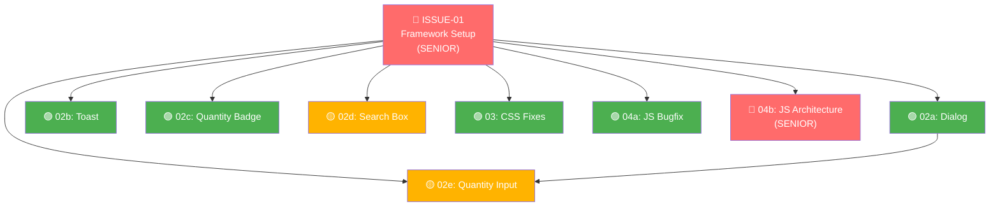

# 📋 Dashboard Isu & Spesifikasi Tugas (AI-Assisted Development Challenge)

Dokumen ini menyediakan spesifikasi dan daftar tugas (backlog isu) untuk meningkatkan kualitas serta menambahkan fitur pada halaman katalog toko online sederhana. Spesifikasi ini disusun berdasarkan persyaratan di [requirement.md](file:///Users/ikhda/Downloads/Test/requirement.md) dan temuan masalah kode pada [index.html](file:///Users/ikhda/Downloads/Test/index.html).

---

## 🎯 Ringkasan Proyek

Tujuan utama dari proyek ini adalah melakukan refaktorisasi terhadap aplikasi katalog belanja sederhana satu halaman ([index.html](file:///Users/ikhda/Downloads/Test/index.html)) ke dalam framework modern (disarankan **React** atau **Vue**), menyelesaikan masalah layout & performa JS yang ada, serta mengimplementasikan 5 fitur baru.

---

## 🚦 Status & Daftar Isu (Backlog)

### 🔴 Senior Dev Only

| ID Isu | Tipe | Judul Tugas | Prioritas | Berkas Spesifikasi |
| :--- | :--- | :--- | :--- | :--- |
| **ISSUE-01** | `TASK` | [Migrasi ke Framework (React/Vue) & Setup Arsitektur](file:///Users/ikhda/Downloads/Test/issues/01-framework-setup.md) | **Kritis** | [01-framework-setup.md](file:///Users/ikhda/Downloads/Test/issues/01-framework-setup.md) |
| **ISSUE-04b** | `BUG` | [Optimalisasi Arsitektural JS — Event Delegation & Lifecycle](file:///Users/ikhda/Downloads/Test/issues/04b-js-architecture-senior.md) | **Sedang** | [04b-js-architecture-senior.md](file:///Users/ikhda/Downloads/Test/issues/04b-js-architecture-senior.md) |

### 🟢 Junior Dev / AI Murah

| ID Isu | Tipe | Judul Tugas | Level | Prioritas | Berkas Spesifikasi |
| :--- | :--- | :--- | :--- | :--- | :--- |
| **ISSUE-02a** | `FEATURE` | [Dialog Konfirmasi (Checkout & Hapus Item)](file:///Users/ikhda/Downloads/Test/issues/02a-dialog-konfirmasi.md) | 🟢 Junior | **Tinggi** | [02a-dialog-konfirmasi.md](file:///Users/ikhda/Downloads/Test/issues/02a-dialog-konfirmasi.md) |
| **ISSUE-02b** | `FEATURE` | [Toast Notification (Feedback Tambah ke Keranjang)](file:///Users/ikhda/Downloads/Test/issues/02b-toast-notification.md) | 🟢 Junior | **Tinggi** | [02b-toast-notification.md](file:///Users/ikhda/Downloads/Test/issues/02b-toast-notification.md) |
| **ISSUE-02c** | `FEATURE` | [Perhitungan Total Kuantitas Badge Keranjang](file:///Users/ikhda/Downloads/Test/issues/02c-total-quantity-badge.md) | 🟢 Junior | **Tinggi** | [02c-total-quantity-badge.md](file:///Users/ikhda/Downloads/Test/issues/02c-total-quantity-badge.md) |
| **ISSUE-02d** | `FEATURE` | [Kotak Pencarian Produk dengan Debounce](file:///Users/ikhda/Downloads/Test/issues/02d-search-box.md) | 🟡 Junior+ | **Tinggi** | [02d-search-box.md](file:///Users/ikhda/Downloads/Test/issues/02d-search-box.md) |
| **ISSUE-02e** | `FEATURE` | [Input Kuantitas Langsung & Update Kelipatan](file:///Users/ikhda/Downloads/Test/issues/02e-quantity-input.md) | 🟡 Junior+ | **Tinggi** | [02e-quantity-input.md](file:///Users/ikhda/Downloads/Test/issues/02e-quantity-input.md) |
| **ISSUE-03** | `BUG` | [Perbaikan Layout & Gaya CSS (Responsivitas)](file:///Users/ikhda/Downloads/Test/issues/03-layout-css-fixes.md) | 🟢 Junior | **Sedang** | [03-layout-css-fixes.md](file:///Users/ikhda/Downloads/Test/issues/03-layout-css-fixes.md) |
| **ISSUE-04a** | `BUG` | [Bug Fix JS — Error Handling & Double-Submit](file:///Users/ikhda/Downloads/Test/issues/04a-js-bugfix-junior.md) | 🟢 Junior | **Sedang** | [04a-js-bugfix-junior.md](file:///Users/ikhda/Downloads/Test/issues/04a-js-bugfix-junior.md) |

---

## 🔗 Dependency Graph (Urutan Pengerjaan)

**Keterangan:**
- 🔴 **Merah** = Senior dev only (JANGAN assign ke junior/AI)
- 🟢 **Hijau** = Cocok untuk junior dev / AI murah
- 🟡 **Kuning** = Junior+ (butuh sedikit pengawasan)
- Panah = dependensi (harus selesai dulu sebelum yang ditunjuk)

---

## 🗺️ Pemetaan Masalah [index.html](file:///Users/ikhda/Downloads/Test/index.html) ke Berkas Isu

| Masalah pada `index.html` | Deskripsi Masalah | Berkas Isu Perbaikan | Level |
| :--- | :--- | :--- | :---: |
| **Masalah 1** (Baris 19) | Kontainer lebar tetap (`1200px`), tidak responsif | [ISSUE-03](file:///Users/ikhda/Downloads/Test/issues/03-layout-css-fixes.md) | 🟢 |
| **Masalah 2** (Baris 38) | Posisi ikon keranjang bermasalah di layar kecil | [ISSUE-03](file:///Users/ikhda/Downloads/Test/issues/03-layout-css-fixes.md) | 🟢 |
| **Masalah 3** (Baris 64) | Grid produk pecah di mobile | [ISSUE-03](file:///Users/ikhda/Downloads/Test/issues/03-layout-css-fixes.md) | 🟢 |
| **Masalah 4** (Baris 251) | Kurang Media Query untuk mobile | [ISSUE-03](file:///Users/ikhda/Downloads/Test/issues/03-layout-css-fixes.md) | 🟢 |
| **Masalah 5** (Baris 264) | CSS Selector terlalu nested | [ISSUE-03](file:///Users/ikhda/Downloads/Test/issues/03-layout-css-fixes.md) | 🟢 |
| **Masalah 6** (Baris 305) | Polusi variabel global | [ISSUE-01](file:///Users/ikhda/Downloads/Test/issues/01-framework-setup.md) | 🔴 |
| **Masalah 7** (Baris 310) | API call tanpa error handling | [ISSUE-04a](file:///Users/ikhda/Downloads/Test/issues/04a-js-bugfix-junior.md) | 🟢 |
| **Masalah 8** (Baris 334) | DOM query berulang & tidak efisien | [ISSUE-01](file:///Users/ikhda/Downloads/Test/issues/01-framework-setup.md) & [ISSUE-04b](file:///Users/ikhda/Downloads/Test/issues/04b-js-architecture-senior.md) | 🔴 |
| **Masalah 9** (Baris 353) | Search tanpa debouncing | [ISSUE-02d](file:///Users/ikhda/Downloads/Test/issues/02d-search-box.md) | 🟡 |
| **Masalah 10** (Baris 414) | Tidak ada feedback setelah add to cart | [ISSUE-02b](file:///Users/ikhda/Downloads/Test/issues/02b-toast-notification.md) | 🟢 |
| **Masalah 11** (Baris 440) | DOM query berulang di cart | [ISSUE-04b](file:///Users/ikhda/Downloads/Test/issues/04b-js-architecture-senior.md) | 🔴 |
| **Masalah 12** (Baris 486) | Checkout tanpa loading state / double-submit | [ISSUE-02a](file:///Users/ikhda/Downloads/Test/issues/02a-dialog-konfirmasi.md) & [ISSUE-04a](file:///Users/ikhda/Downloads/Test/issues/04a-js-bugfix-junior.md) | 🟢 |
| **Masalah 13** (Baris 502) | Inline event handler, no delegation | [ISSUE-04b](file:///Users/ikhda/Downloads/Test/issues/04b-js-architecture-senior.md) | 🔴 |
| **Masalah 14** (Baris 503) | Resize event tanpa debounce | [ISSUE-04a](file:///Users/ikhda/Downloads/Test/issues/04a-js-bugfix-junior.md) | 🟢 |
| **Masalah 15** (Baris 509) | Load awal tanpa error handling | [ISSUE-04a](file:///Users/ikhda/Downloads/Test/issues/04a-js-bugfix-junior.md) | 🟢 |
| **Masalah 16** (Baris 514) | Event listener global tidak dibersihkan | [ISSUE-04b](file:///Users/ikhda/Downloads/Test/issues/04b-js-architecture-senior.md) | 🔴 |

---

## 🛠️ Alur Kerja & Pengembangan

1. **🔴 [Senior] Persiapan Project (ISSUE-01)**: Senior dev menginisialisasi proyek React/Vue, membuat scaffolding komponen, dan menyiapkan state management.
2. **🟢 [Junior/AI] CSS Fixes (ISSUE-03)**: Perbaiki responsivitas dan struktur CSS. Bisa dikerjakan paralel.
3. **🟢 [Junior/AI] Fitur Baru (ISSUE-02a s/d 02e)**: Kerjakan 5 fitur baru secara paralel setelah ISSUE-01 selesai.
4. **🟢 [Junior/AI] JS Bug Fix (ISSUE-04a)**: Perbaiki error handling, double-submit, dan resize debounce.
5. **🔴 [Senior] Verifikasi Arsitektur (ISSUE-04b)**: Senior dev memverifikasi tidak ada memory leak, semua event listener clean.
